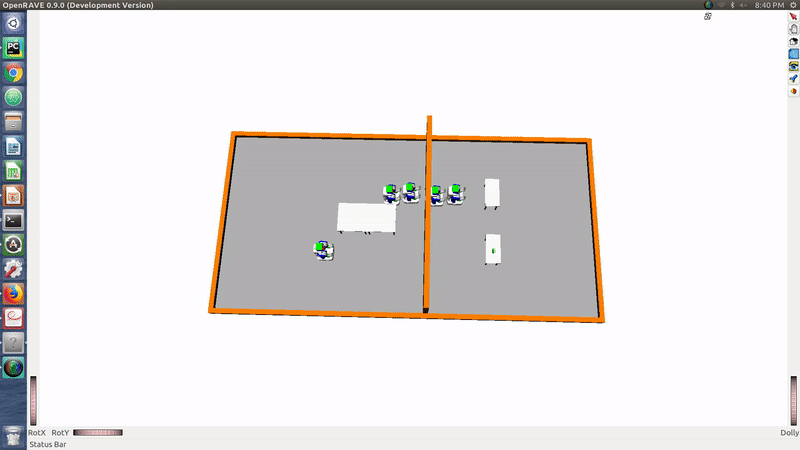

# MotionPlanningProject
SIPP+BiRRT+PriorityPlanner

### Abstract:
The multi-robot path planning problem is a heavily researched field in motion planning. Multi-robot path
planning is difficult considering the exponential number of plans that are possible. For a realistic world
scenario, it becomes essential to include obstacles which makes the problem even harder. In this project
I propose an algorithm that can generate a path from the initial state to the final state for one particular
robot among multiple robots using approaches from manipulation planning and multi-robot planning. We
take inspiration from the manipulation planning domain to resolve any spatial constraints in the path of
this robot and then use it to solve the multi-robot path planning problem simultaneously instead of a
discrete fashion.

### Introduction and Background:
While using our robots to accomplish tasks, we strive for maximum efficiency in terms of the energy
consumed and minimum time in the task completion. I am trying to solve a small portion of the big
coordination problem in multi-robot path planning. This can be used in variety of real world scenarios
such as planning coordinated robots in industrial warehouses, coordinating drones for product delivery
and similar use cases. This project aims to solve one instance of the robot coordination problem where
we have to move a robot from one place to another in an environment where there are multiple robots
that can be static or dynamic. The problem can be easily understood by taking the example of an
autonomous ambulance moving in the midst of a fleet of autonomous vehicles. The ambulance has to be
given priority on the road as lives are at stake in this case. So my problem assumes the situation when the
ambulance act as a centralized motion planner for all the vehicles in the scene and instructs other vehicle
on the road to take appropriate measures so as to let the ambulance pass. I propose to solve this problem
using backward planning from the goal to identify the obstacles and using the obstacle map to plan
forward using safe interval path planner. The backward planner draws its approach from [1] where the
authors are using the backward planner to identify and manipulate obstacles in a situation where the
robot has to draw certain tool stuffed in a tool box. The multi-robot path planning problem is solved using
[2] which uses a modified version of the conventional A* approach. As we are dealing with multiple robots
in this case, time becomes a factor to consider and is thus integrated into the A* algorithm. This Safe
Interval path planner provides a mean for reliable planning in the multi-robot path planning domain. Some
other useful mentions here are the RRT [3] and RRT Connect algorithms [4]. [5] explains important
concepts in multi-robot path planning domain such as prioritized planning, communication issues and
decentralized approach.

### Proposed work:
For this implementation I would be solving just for the static case but this can be easily extended to the
dynamic case as well. In this problem we have an ambulance that is doing the planning for itself as well
as the remaining autonomous cars. It is responsible for the coordination in the environment. The problem
that I would be addressing would be to help navigate the ambulance to its final position by generating
and planning a coordinated plan for all the cars. The project presents an algorithm where backward
planning is done to identify the cars that are in the way of our ambulance that has to be moved to the
goal. The backward planner gives us the cars to move and then a Safe interval path planner can be used
to plan for the multiple robots simultaneously.The backward planner plans from the goal backward to identify the different obstacle cars in the way of
the ambulance. The backward planner uses RRT connect to find a feasible path for the ambulance and
provides all the obstacles in between. These obstacles are added to a tree. The parent node in the tree
corresponds to the car or ambulance that we are trying to solve for and the child node correspond for the
cars that are obstacles. For the path given by the RRT connect algorithm to be feasible these child nodes
should be displaced. This is done recursively to identify the obstacles that are constraining the child cars
from moving. In case of a highly cluttered environment this tree can be substantially big.
After resolving the spatial constraints, we formulate a coordinated plan to execute on the robots. Safe
Interval path planning algorithm is used to solve this problem. We have the start and goal positions of all
the cars and ambulance and we want to execute the plan in minimum time. In the safe interval path
planning algorithm we first solve for the leaf nodes as they need to be displaced first to make room for
their parents using a modified version of the A* search that includes safe intervals in it. Safe interval
associated with a node just tell us when the particular grid cell is vacant as in our discretization of the
environment, cells would have multiple robots occupying the same grid cell at different time intervals.
This gives us a dynamic occupancy map for the grid cells that has to be accounted for in the planning for
the robots. We traverse up the tree resolving spatial constraints for parents by building the trajectories
incrementally for children nodes to get a feasible path for the ambulance within its time constraints.
Proposed Experiments and Expected Outcomes:
I would be simulating multiple PR2 in the openRave environment. Multiple PR2 would be obstructing the
ambulance PR2 which is the robot that we have to move and that would lead us to plan for a coordinated
effort to solve the problem. The expected outcome of the experiments would be a coordinated effort by
the PR2’s to disperse and let the ambulance carry out its plan without collisions with the environment
objects. There are multiple scenarios to experiment in this project. One particularly interesting
experiment would be to have a long narrow passage in the trajectory of the ambulance having a lot of
obstacles in the passage. This would constrain the obstacle nearest to the exit of the passage to move out
first from both sides, then the next one and so on. The metrics evaluated on this approach would be time
required to reach the final goal by our approach, the distance travelled in our approach, the completeness
and optimality guarantees which can be compared to a baseline to see the effectiveness of our approach.

### References:
1. Stilman, Mike, et al. "Manipulation planning among movable obstacles." Robotics and Automation,
2007 IEEE International Conference on. IEEE, 2007.
2. Araki, Brandon, et al. "Multi-robot path planning for a swarm of robots that can both fly and
drive." Robotics and Automation (ICRA), 2017 IEEE International Conference on. IEEE, 2017.
3. LaValle, Steven M. (October 1998). "Rapidly-exploring random trees: A new tool for path
planning" (PDF) . Technical Report. Computer Science Department, Iowa State University (TR 98-11)
4. LaValle, Steven M., and James J. Kuffner Jr. "Rapidly-exploring random trees: Progress and
prospects." (2000).
5. Čáp, Michal, et al. "Prioritized planning algorithms for trajectory coordination of multiple mobile
robots." IEEE transactions on automation science and engineering 12.3 (2015): 835-849.
